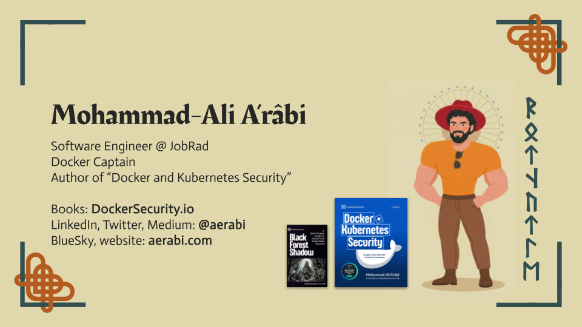

# Mohammad-Ali A'râbi

**Senior Backend Engineer • Docker Captain • Snyk Ambassador • Author**

Senior Software Engineer with 20 years of experience specializing in **Container Security**, **DevSecOps**, and **Cloud-Native Architecture**. I believe in "Education through Storytelling"—making complex security concepts accessible through narrative and practical implementations.

---

### 🛡️ Core Expertise
- **Security:** Container & K8s Security, Supply Chain Security (SBOM, Attestations, VEX), DevSecOps.
- **Backend:** Python, Node.js, Software Architecture, Secure CI/CD Pipelines.
- **Leadership:** CNCF Chapter Organizer, Open Source Mentor (GSoC, LFX).

---

### 📚 Published Books

| Book | Description |
| :--- | :--- |
| **[Docker and Kubernetes Security](https://www.dockersecurity.io)** (2025) | A comprehensive guide to securing containers from supply chain to runtime. Finalist for *Best DevOps Book of the Year*. |
| **[Black Forest Shadow](https://www.dockersecurity.io/black-forest-shadow)** (2026) | A dark fantasy guide to container security, using folklore to teach DevSecOps principles. |

---

### 🎙️ Latest Blog Posts
*Selected highlights from [dockersecurity.io/blog](https://dockersecurity.io/blog)*

- **[Seven Docker Tips Every Engineer Should Know (from Docker Captains)](https://www.dockersecurity.io/blog/seven-docker-captain-tips-from-twitter)**
- **[The Largest NPM Supply Chain Attack Ever and How to Defend Against It](https://dockersecurity.io/blog/the-largest-npm-supply-chain-attack-ever-and-how-to-defent-against-it)** - A breakdown of the 2025 attack and 7 practical defense steps.
- **[Dockerize Java 26 with docker init](https://dockersecurity.io/blog/dockerize-java-26-with-docker-init)** - Modernizing Java containerization.
- **[Generating an SBOM with Docker Scout](https://dockersecurity.io/blog/generating-an-sbom-with-docker-scout)** - Practical guide to software bill of materials.

---

### 🎤 Recent & Upcoming Talks
- **Beyond SBOMs: The Future of Container Supply Chain Security** @ *WeAreDevelopers Berlin* & *DevOpsDays Zurich* (2026)
- **Defense Against the Dark Arts: NPM Attack** @ *EnterJS Mannheim* (2026)
- **Dockerize Securely: SBOMs + Attestations + Bake** @ *Jfokus Stockholm* (2026)
- **Java Supply Chain Security with Docker** (Workshop) @ *JCON Europe* (2026)

---

### 🤝 Community & Mentorship
- **CNCF Freiburg Chapter Organizer:** Leading a community of 1,000+ members at **[Cloud Native Freiburg](https://community.cncf.io/cloud-native-freiburg/)**.
- **GSoC 2026 Mentor:** Primary mentor for The Linux Foundation on "SBOM Conformance and SPDX 3 Support".
- **LFX Mentorship:** Guided 24+ mentees through the Linux Foundation Mentorship Program.

---

### ✉️ Connect & Follow
- **Newsletter:** [Docker Security Dispatch](https://www.linkedin.com/newsletters/docker-security-dispatch-7444856603549446144/) • [Git Weekly](https://git-weekly.com)
- **Social:** [Twitter](https://twitter.com/MohammadAliEN) • [LinkedIn](https://www.linkedin.com/in/aerabi/) • [Medium](https://aerabi.medium.com)
- **Website:** [dockersecurity.io](https://dockersecurity.io)

---

> **Fun Fact:** I've been wandering the Mojave Wasteland in *Fallout: New Vegas* for 15 years and still haven't found everything. ☢️
